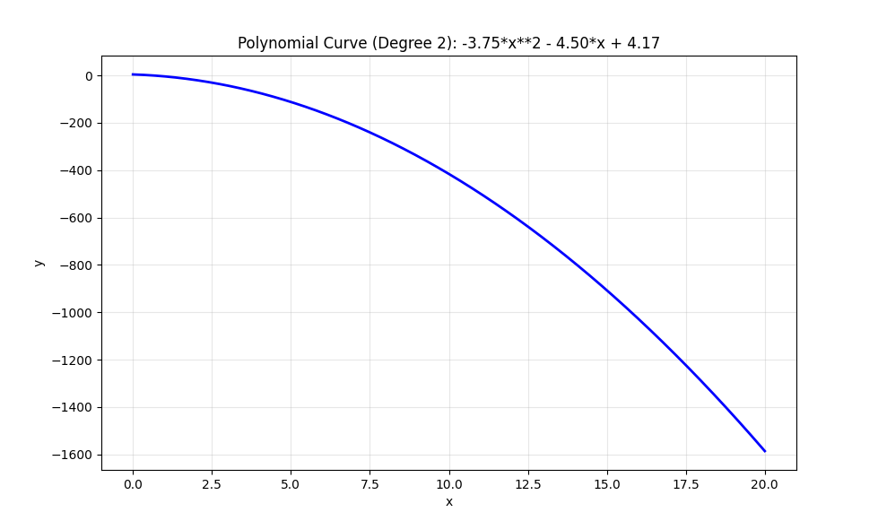
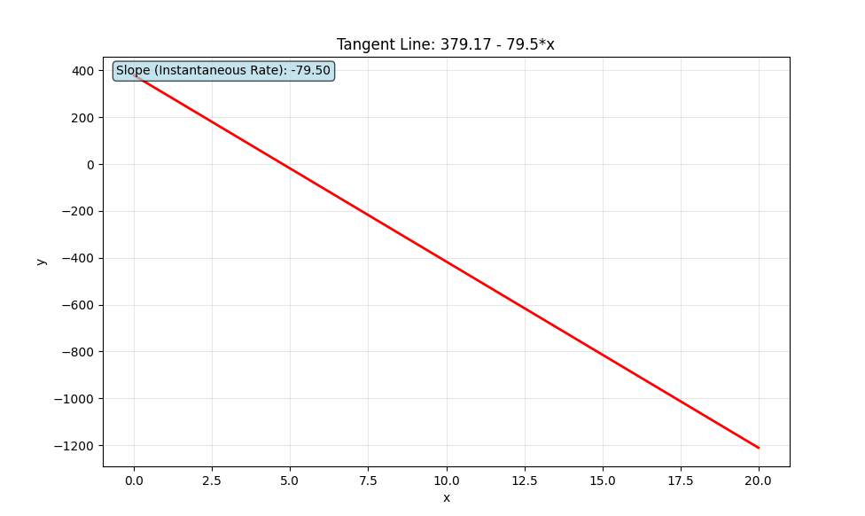
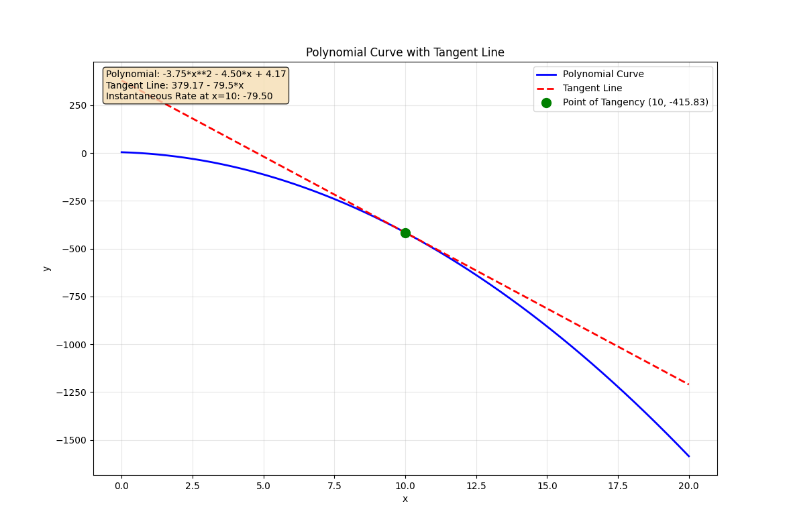

# Instantaneous Rate of Change Calculator

A Python project that generates random polynomial curves and calculates the instantaneous rate of change at any point using derivatives and tangent lines.

## Overview

This program:
1. Generates a random polynomial equation
2. Finds the tangent line at a specific point
3. Calculates the instantaneous rate of change (derivative) at that point
4. Displays polynomial graph, tangent line graph, then both graphs together

## Requirements

Start an virtual environment:

https://docs.python.org/3/library/venv.html

```bash
pip install sympy matplotlib
```

## Usage

Run the main program:
```bash
python main.py
```

## Example Output

```
[-3.7482081877974673, -4.5016147894208345, 4.166184518768379] # Random coefficients
-3.75*x**2 - 4.50*x + 4.17                                    # Polynomial equation
379.17 - 79.5*x                                               # Tangent line at x=10
-415.83                                                       # Value at x=10
```
1. polynomial graph



2. tangent line graph



3. both graphs combined




## How It Works

The program uses calculus concepts:
- **Derivative**: The rate of change of the polynomial
- **Tangent Line**: A line that touches the curve at exactly one point
- **Instantaneous Rate**: The slope of the tangent line (derivative value)